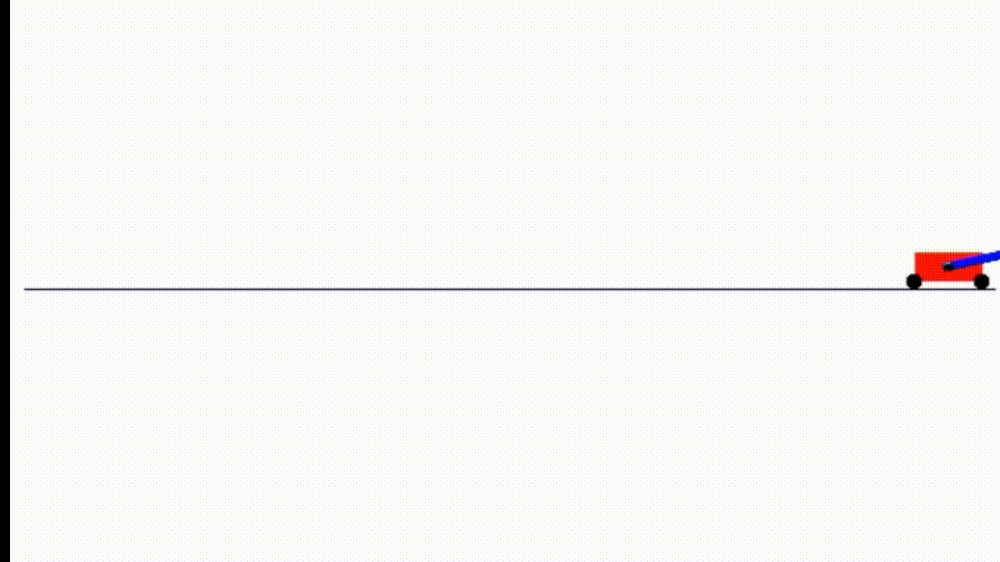

# CartPole-RL
Deep-Q Learning to solve the Swing-Up Cartpole problem.  
  
Implements Deep-Q Learning, Deep-Q Learning with replay and Double Deep-Q Learning with replay to train an agent to solve the Swing-Up Cartpole Problem.

## Best Result

## Dependencies
- Anaconda
- OpenAI Gym
- PyTorch
- Matplotlib
- Pillow (PIL)
- NumPy